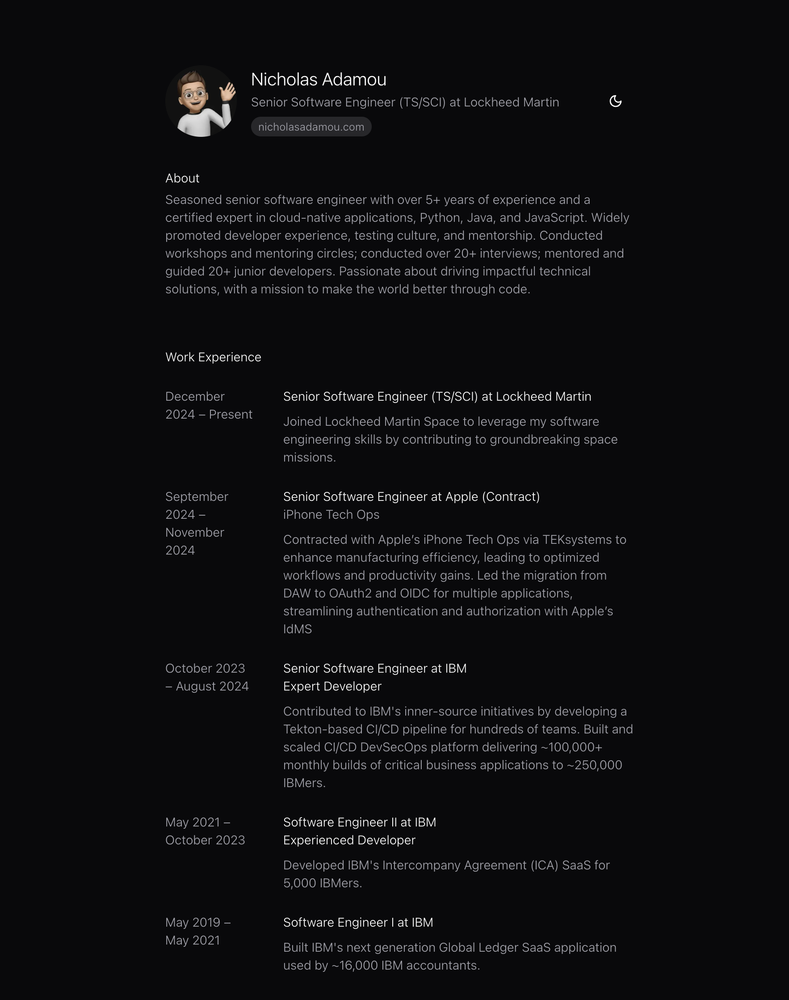

# my-cv

A personal CV website based off of [next-cv](https://github.com/nicholasadamou/next-cv) built with Next.js, TypeScript, Tailwind CSS, and Framer Motion.

## Getting Started

Learn how to set up the project locally by reading the [Getting Started](https://github.com/nicholasadamou/next-cv#getting-started) guide for _next-cv_.
